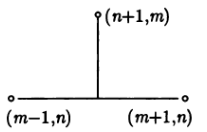
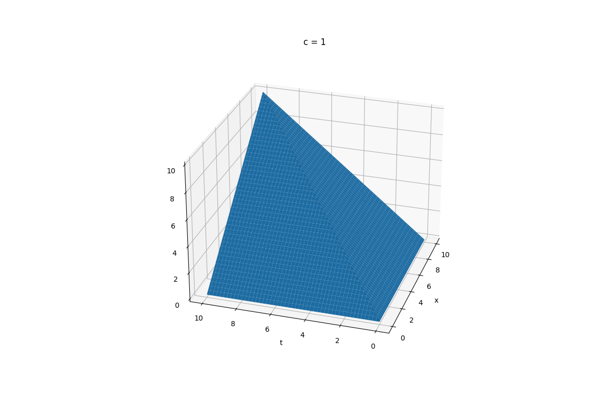
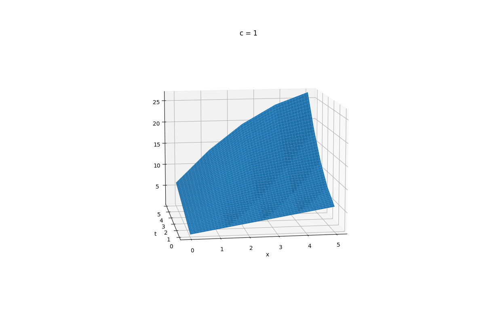
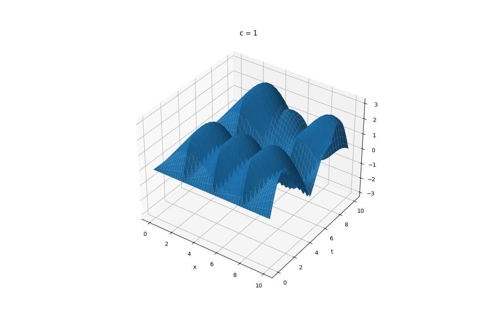
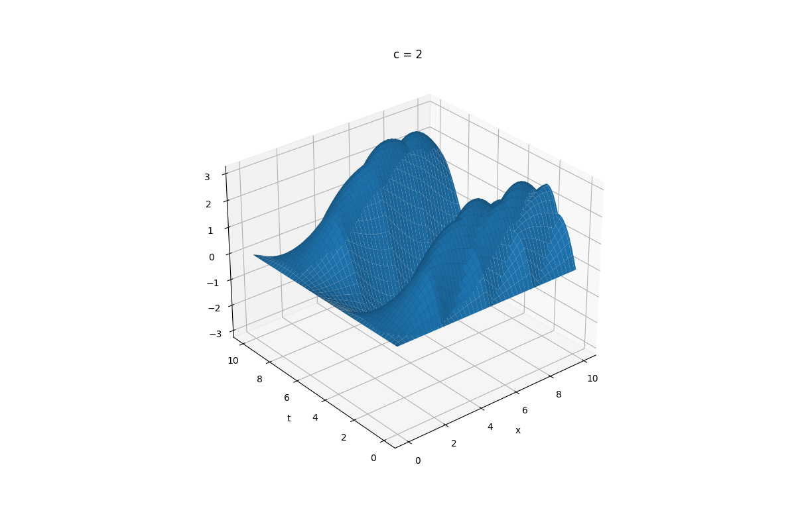
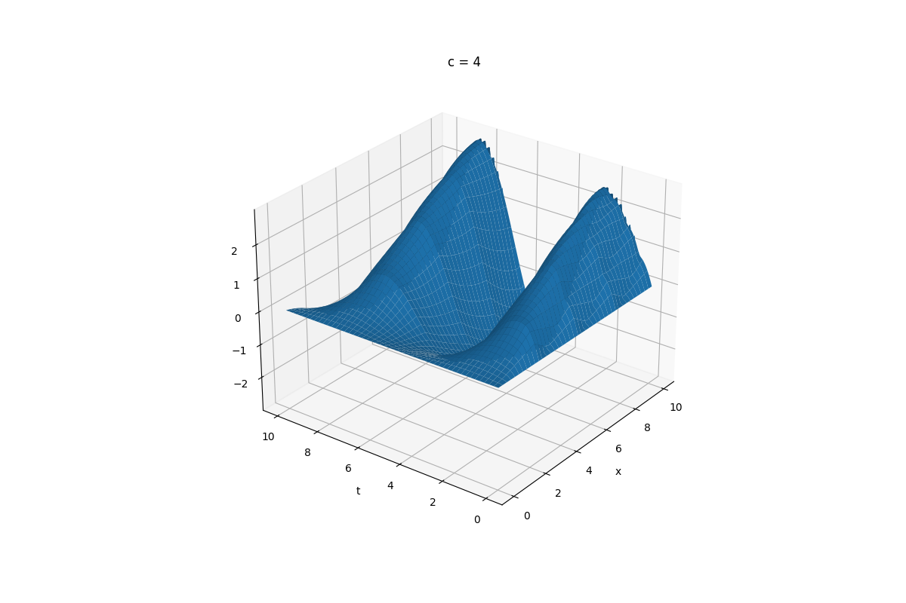
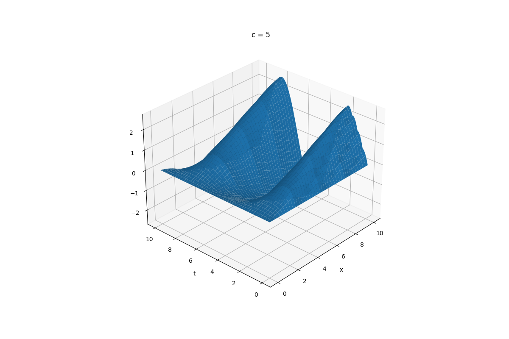
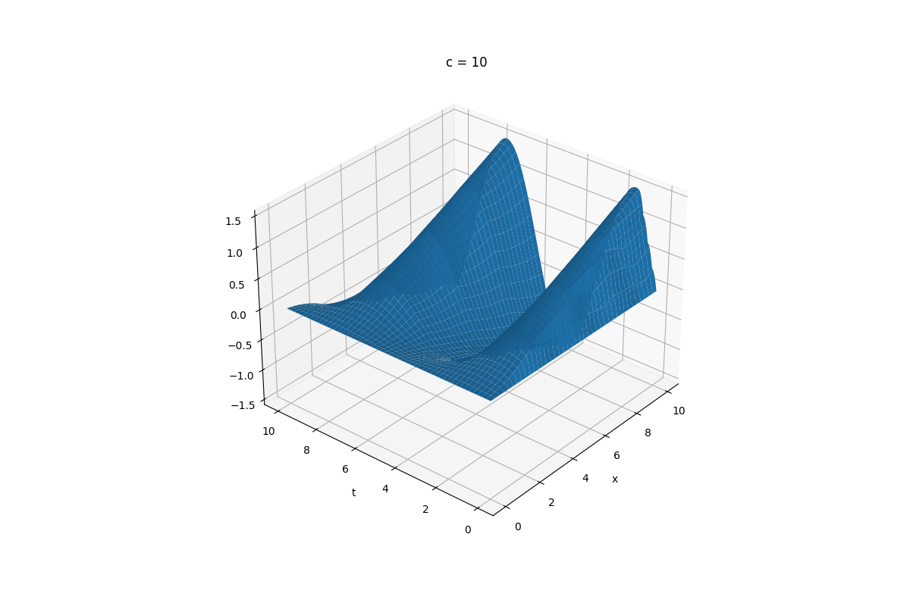
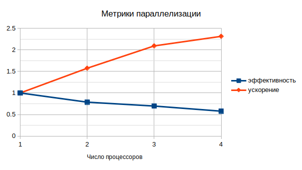

To run calculations:
* Enter parameters in `config` file
* Do `./run.sh <nworkers>`. Default number of workers is 4

To plot solution run `python3 plot.py`

# Отчет

## Вычислительная математика

### Метод

В даннной лабораторной работе реализован поиск численного решения для уравнения переноса:

$\frac{\partial u(t,x)}{\partial t} + c\frac{\partial u(t,x)}{\partial x} = f(t, x), 0 \leq t < \leq T, 0 \leq x \leq X$

$u(0, x) = \phi(x), 0 \leq x \leq X$

$u(t, 0) =  \psi, 0 \leq t \leq T$

Вычисления проводятся на сетке $t = n\tau, x = mh$ с помощью явной центральной трехточечной схемы (схема Лакса). Схема обладает порядком аппроксимации $O(\tau + h^2 + h^2/\tau)$

Разностное уравнение:

$\frac{u^{n+1}_m - 0,5(u^n_{m+1} + u^n_{m-1})}{\tau} + c\frac{u^n_{m+1} - u^n_{m-1}}{2h} = f^k_m$

Схема является устойчивой при выполнении условия Куранта

$\sigma = c\tau / h \leq 1$

### Примеры работы

$f(t, x) = 1, 0 \leq t < \leq 10, 0 \leq x \leq 10$

$u(0, x) = 0$

$u(t, 0) =  0$

$u(x, t) = (x + 1)(t + 1)$

$f(t, x) = x + y + 2, 0 \leq t < \leq 5, 0 \leq x \leq 5$

$u(0, x) = x + 1$

$u(t, 0) =  t + 1$

Исследуем как меняется решение при варьировании параметра $c$

$u(x, t) = x\sin(t)$

$f(t, x) = x\cos(t) + sin(t), 0 \leq t < \leq 10, 0 \leq x \leq 10$

$u(0, x) = 0$

$u(t, 0) =  0$

Видно что с ростом параметра пики быстрее сдвигаются вдоль координаты $x$. Это отвечает росту скорости переноса.

# Имплементация

## Вычислительная схема

Весь код содержится в файле [net.cpp](net.cpp). Реализацию схемы можно найти в функции `fill_layer()`.

## Параллелизм

Посчитаем ускорение и эффективность программы. Значения для 4 процессоров: $S = 2.3$; $E = 0.58$

